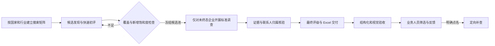

# B2B Prospect Research · 外贸潜在客户调查

面向工业材料外贸的 **Agent 辅助企业调查工作流**。将候选发现、证据整理、业务优先级和质量验收组织成可追溯的流程，并以 Excel 交付业务人员。

**此仓库是公开作品集版本：包含真实项目复盘、方法说明和使用虚构数据的离线规则演示。不是完整生产系统，也不包含真实客户资料。**

## 一分钟了解

| 问题 | 设计 |
| --- | --- |
| 查到公司名称后，仍需确认主体和业务匹配 | 保留企业产品/工艺证据、来源与核验日期 |
| 多轮评级容易触发重复调查 | 调查状态与 A/B/C/D 优先级分离；完成后不自动重查 |
| 数据看起来完整，联系人却未必有用 | 区分公司通用入口、具名人员与归属待核验线索 |
| 业务人员不使用开发工具 | 真实业务交付采用 Excel；内部保留结构化记录和验收 |

项目由 Zegang Cui 独立发起并推进需求整理、工作流设计、业务沟通与迭代；AI 编程与研究工具辅助生成代码、资料和检查结果。公开演示于 2026-10-07 整理，不代表历史生产代码的完整开源。

## 阅读入口

- [项目案例与设计取舍](docs/case-study.md)
- [精简 PRD（回顾整理）](docs/prd.md)
- [调查操作方法](docs/research-playbook.md)
- [架构、数据与实现边界](docs/architecture.md)
- [成果口径、证据与评估](docs/evaluation.md)

## 真实项目进展

历史项目记录：马来西亚 301 家企业达到标准调查终态（2026-09-08）；印尼 1,004 家企业达到标准调查终态并留存国家验收报告（2026-09-23）。终态包括低匹配和未发现可靠联系入口，并不意味着每家企业都具备高质量联系方式。

这些是**调查覆盖规模**，不是客户数、有效询盘或订单数。历史验收不证明当前所有信息仍有效；联系人质量后续仍在补充核验。原始业务数据不公开，因此外部读者无法从本仓库独立复验上述生产规模。详见[证据口径](docs/evaluation.md)。

## 运行演示

需要 Python 3.10 或更高版本。无第三方依赖、无 API 密钥、无联网请求。

```sh
python demo.py
python -m unittest discover -s tests -v
```

Windows 上也可以使用 `py -3 demo.py`。在仓库根目录执行即可。

输入：[examples/synthetic_batch.json](examples/synthetic_batch.json)。公司、联系人及证据均为虚构，域名使用保留的 `.example`。

输出包含：校验是否通过、分级数量、研究是否全部终态、待研究队列及待人工核验联系入口。演示不会搜索互联网、调用模型、生成 Excel 或发送邮件。

你可以试着把某条记录的 `grade` 改成与分数不符，或移除证据日期，再运行，观察验收拒绝的原因。修改前后可使用 Git 比较差异。

## 工作流



图表示真实项目的设计流程。公开代码只演示其中的结构化校验、评级一致性和待研究队列规则。

## 已知不足

- 没有建立独立人工标注集，不能给出真实调查准确率。
- 缺少同口径工时基线，不能声称效率提升倍数。
- 交付与实际采用不同；早期使用反馈存在分化。
- 公开资料可见，不代表联系人现任、邮箱可送达或存在采购意向。
- 历史记录未提供可归因成交证据；后续应跟踪采用、送达、有效回复和商机。

## 文件与发布范围

`docs/` 存放案例和方法，`src/` 存放离线演示规则，`examples/` 存放虚构数据，`tests/` 存放规则回归测试。

本仓库不包含公司产品图片/技术指标、真实企业与联系人清单、邮件记录、凭证、内部日志或私人求职档案。生产源码未直接迁入；演示代码根据流程原则重新整理。当前未授予额外开源许可证，公开可见不等于可任意再分发。
